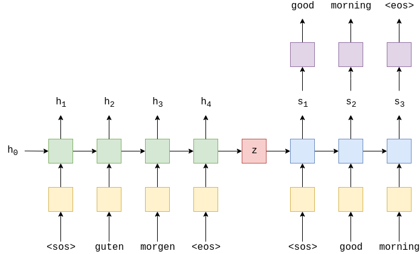
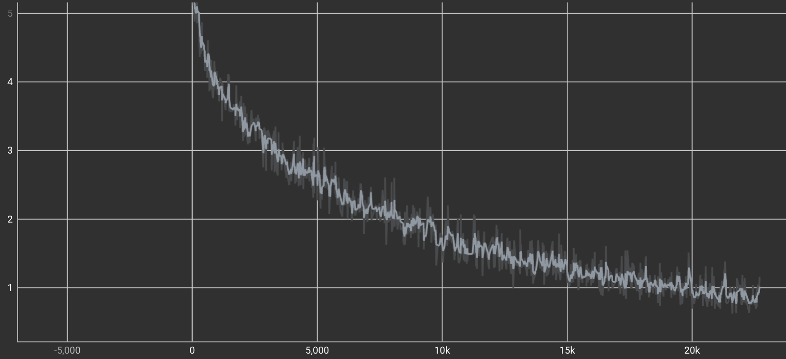

[](https://classroom.github.com/a/wT71nrpQ)
[](https://classroom.github.com/online_ide?assignment_repo_id=11110476&assignment_repo_type=AssignmentRepo)

# Neural Networks and Deep Learning - Language Translation

## Objectives
The goal of this project was to create a machine learning language translator.
We used a Encoder-Decoder RNN model that would take a german sentence and attempt to translate it into english.

In the encoder take the input sentence and pass it through an embedding layer, using this embedding we generate a context vector (hidden state) using an RNN layer.

In the decoder we attempt to decode the sentence one word at a time using the context vector generated from the encoder as well as an embedding of the previous word. In the decoder we also use teacher forcing, this is a conditional statement that tells the decoder to use the previously predicted word or the true word which comes from the target data.

Here is an example image of how the encoder-decoder model looks.
At each step a new context vector is created, in the decoder model we use the context vector aswell as an word embedding as an input.
[]


### Data
We used the Multi30k dataset and spaCy for tokenizatoin. 
Multi30k is a dataset with 30000 english and german sentences, each with 12 words.
spaCy is a module that contains helper functions for language processing.

We convert each sentence into a list of tokens e.g. `This is a sentence!` becomes `['This', 'is', 'a', 'sentence', '!']`, we also convert all characters to lower case for normalization.

### Loss
In the end the best loss achieved was: 0.7839



## Getting started
### Requirements
The environment used in the repo is a conda env generated from the `environment.yml` file.

The required python modules and versions are:
```
pytorch=1.7.1
torchtext=0.8.1
spaCy=3.5.3
```

### To Activate environment
```
conda env create --file environment.yml
conda activate xnap-example
```

### Install spaCy Datasets
```
python -m spacy download en_core_web_sm
python -m spacy download de_core_news_sm
```

### To train model
`python train.py`


## Usage
To use the model to translate a sentence run `python main.py --translate 'string to be translate'` or `python main.py` will use 10 examples sentences from the testing data.
```
$> python main.py --translate 'Was geht ab'
$> Input sentence:
$> Was geht ab
$>
$> Translated sentence:
$> What's up

----------------------------------------

$> python main.py
$> Input sentence:
$> personen halten verschiedene arten von trommelschlägeln über unterschiedliche trommeln .
$> 
$> Translated sentence:
$> people are balancing various <unk> various <unk> , possibly their <unk> . <eos>
$> 
$> Actual sentence:
$> people are holding various types of drumsticks above different kinds of drums
```


## Code structure
### Models
Models are stored in `models/models.py`
In this file you will find the Encoder, Decoder and Seq2Seq models that the language translator relies on.

### Training
The training loop is found in `train.py`
This is a basic python file that imports the datasets and models and performs the training loop. 
To use:
`python train.py`

### Utils
The `utils/utils.py` file contains some helper functions such as `save_checkpoint()` and `load_checkpoint()`


# Summary
1. Overall the model was trained for 200 epochs with batches of 64 with each input being a 12 word sentence.
2. In the end the model seems to perform better when using sentences from the testing data, when translate hand written sentences the model seems to perform pretty poorly. This probably stems from the fact that all sentences used to train the model were a fixed length of 12 words.
3. The model's accuracy greatly drops off towards the end of the sentences. This could probably be improved if we added attention to the decoder.

## Contributors
1675495 - Bailey Yates Armitage\
1630353 - Pablo García Villagrasa\
1679434 - Sixtine Lorphelin


Xarxes Neuronals i Aprenentatge Profund
Grau de __Write here the name of your estudies (Artificial Intelligence, Data Engineering or Computational Mathematics & Data analyitics)__, 
UAB, 2023
